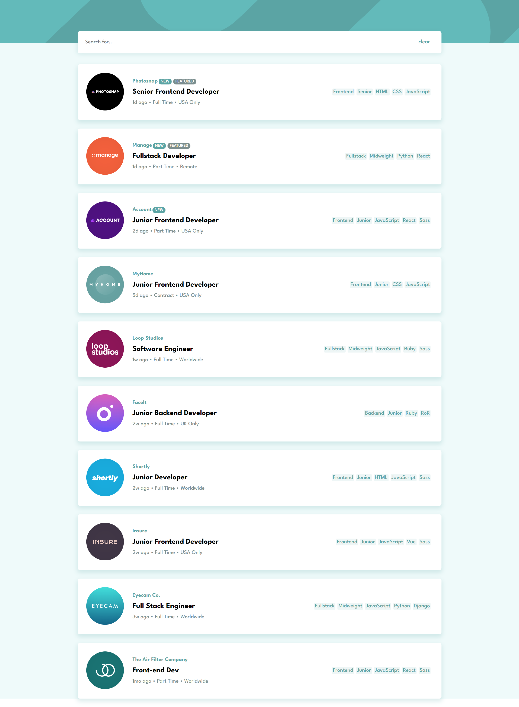
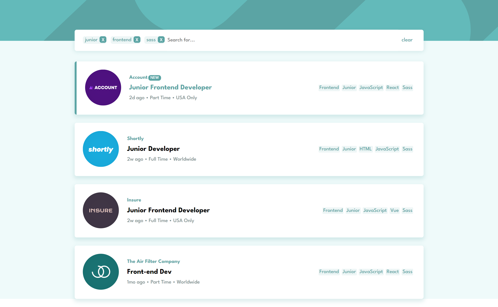
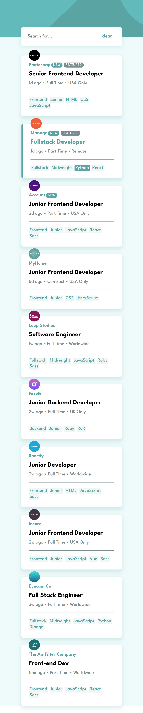

# Frontend Mentor - Job listings with filtering solution

이 솔루션은 [Job listings with filtering challenge on Frontend Mentor](https://www.frontendmentor.io/challenges/job-listings-with-filtering-ivstIPCt) 챌린지 참여 결과물입니다.

## 차례

- [소개](#소개)
  - [챌린지](#챌린지)
  - [화면 스크린샷](#화면-스크린샷)
  - [링크](#링크)
- [배운 점](#배운-점)
  - [사용 tool](#사용-tool)
  - [새롭게 배운 것](#새롭게-배운-것)
  - [앞으로 배울 것](#앞으로-배울-것)
  - [참고 사이트](#참고-사이트)
- [제작자](#제작자)
- [기타사항](#기타사항)

## 소개

### 챌린지

구인구직 사이트에서
키워드를 통한 검색 기능을 구현한 뒤
gh-pages로 배포하였다.

### 화면-스크린샷






### 링크

- Solution URL: [Github](https://github.com/juurom/Searchbar___frontendMentor/)
- Live Site URL: [Live Site](https://juurom.github.io/Searchbar___frontendMentor/)

## 배운-점

### 사용-tool

- CSS
- REACT
- gh-pages

### 새롭게-배운-것

1. 컴포넌트 반복 생성하기
(지난 프로젝트에서 돌려막기식으로 했던 거... 이제 할줄 알게 됐다)

똑같은 틀에 내용만 바꾸어서 생성해야 할 경우 map을 사용하면 편리하다.

직업 데이터가 담긴 json array파일에서 필요한 텍스트만 바꿔치기하는 부분에서 사용했다.
실제 작성한 코드는 다음과 같다.

jobData.json
```json
[
  {
    "id": 1,
    "company": "Photosnap",
    "logo": "photosnap.svg",
    "new": true,
    "featured": true,
    "position": "Senior Frontend Developer",
    "role": "Frontend",
    "level": "Senior",
    "postedAt": "1d ago",
    "contract": "Full Time",
    "location": "USA Only",
    "languages": ["HTML", "CSS", "JavaScript"],
    "tools": []
  },
  {
    "id": 2,
    "company": "Manage",
    "logo": "manage.svg",
    "new": true,
    "featured": true,
    "position": "Fullstack Developer",
    "role": "Fullstack",
    "level": "Midweight",
    "postedAt": "1d ago",
    "contract": "Part Time",
    "location": "Remote",
    "languages": ["Python"],
    "tools": ["React"]
  },
]
  //...and more...
```

Job.js
```jsx
{jobData.map((data)=>(
  <div className="job" key={data.id}>
      <div className="logo">
          
      </div>
      <div className="info">
          <div className="company">
              {data.company}
              {data.new === true && <div className="new">NEW</div>}
              {data.featured === true && <div className="featured">FEATURED</div>}
          </div>
          <div className="position">
              {data.position}
          </div>
          <div className="condition">
              {data.postedAt}   •   {data.contract}   •   {data.location}
          </div>
      </div>
      <div className="keyword">
          <span className="keywordEach">{data.role}</span>
          <span className="keywordEach">{data.level}</span>
          {data.languages.map((d)=><span className="keywordEach">{d}</span>)}
          {data.tools.map((d)=><span className="keywordEach">{d}</span>)}
      </div>

  </div>
))
}
```

2. filter(), includes()를 통한 검색 기능 구현


검색 기능을 부분부분 나누어서 살펴보자.

(a) 검색어가 아직 없을 때

일단 filter()를 통해 필요한 데이터를 골라낸다.
filter()함수를 통해 배열에서 특정 조건에 해당하는 항목을 배제시킬 수 있다.

실제 코드에서는 페이지 검색 시 검색어에 맞는 직업 div만을 보여줘야만 했다.
그래서 위 jobData.map을 돌리기 전에 filter()를 실행해 주었다.


filter()함수에 대해 알아보자.

**SYNTAX**
```js
array.filter(function(currentvalue, index, arr), thisvalue)
```

**PARAMETERS**
-function(): 필수, 배열의 각 항목에 대해 실행되는 함수이다.
-currentvalue: 필수, 항목의 현재 값이다.
-index: 선택, 항목의 현재 인덱스 값이다.
-arr: 선택, 항목이 속한 배열이다.
-thisvalue: 선택(기본값 undefined), 함수에 this로 전해지는 값이다.

**RETURN VALUE**
-array: function()의 조건에 통과한 값만으로 이루어진 배열을 반환한다. 만약 기존 배열의 항목들 가운데 조건을 통과한 항목이 없다면 빈 배열을 반환한다.


실제 사용한 코드는 아래와 같다.

```jsx
jobData.filter((data)=>{
            if (KeywordList.length===0) return data;
```

KeywordList는 검색어로 입력된 keyword를 모두 담은 배열이다. 만약 KeywordList의 길이가 0이면, 즉 검색어가 아직 없는 상태라면 모든 직업 div를 보여주어야 했으므로 data를 전부 return해 주었다.


(b) 검색어가 입력되었을 때

data가 가지고 있는 데이터 이름 중에 검색어와 비교해야 할 것은 'level, role, languages, tools'였다. 이 중 languages와 tools는 배열이었다. 예시 객체를 하나 가져와 보면 이렇다.

```json
{
    "role": "Fullstack",
    "level": "Midweight",
    "languages": ["HTML", "CSS", "Python"],
    "tools": ["React"]
}
```

그래서 for 문을 사용해 jobData 배열의 각 객체에 접근했고, 산재해 있는 객체 안의 데이터들을 tmpdata라는 배열 안에 집어넣어 주었다.
그리고 keywordList에 있는 각 keyword들을 tmpkeyword에 할당해 주었다.

이때, 검색어의 대소문자 여부에 관계없이 검색되도록
tmpdata와 tmpkeyword를 모두 toLowerCase()로 소문자화 해주었다.

```jsx
let tmpdata=""; let tmpkeyword=""; let returncheck=true;
//returncheck는 (c)에서 설명한다.
            for(let i=0; i<KeywordList.length; i++){
                tmpdata=[data.level.toLowerCase(), data.role.toLowerCase()].concat(data.languages.map(d=>d.toLowerCase()), data.tools.map(d=>d.toLowerCase()));
                tmpkeyword=KeywordList[i].toLowerCase();             
```


(c) 모든 조건을 만족할 때만 검색되도록

array.includes()를 사용하여 검색어가 포함되어 있는지 확인해 주었다.
includes() 함수에 관해 알아보자.

**SYNTAX**
```js
array.includes(valToFind, startIdx)
```

**PARAMETERS**
-valToFind: 필수, 찾고자 하는 배열의 항목이다.
-startIdx: 선택(기본값 0), 탐색을 시작하고자 하는 인덱스이다.

**RETURN VALUE**
-boolean: 포함되어 있으면 true, 포함되어 있지 않으면 false.


실제 사용한 코드는 아래와 같다.

```jsx
if(!tmpdata.includes(tmpkeyword)){
                    returncheck = false;
                }
            }
            if (returncheck) return data;
        }
```

예를 들어, "html", "css"를 검색했을 때
"html"은 포함하고 있지만 "css"는 포함하고 있지 않은 직업은 검색에 보여주지 않아야 한다.
즉 검색어 키워드를 모두 가지고 있는 직업만 보여주어야 한다.
그래서 검색어가 하나라도 없으면 returncheck를 false로 만들었으며, returncheck가 true일때만 data를 반환하도록 했다.


(d) 종합!
검색 기능에 사용된 전체 코드는 아래와 같다.

```jsx
jobData.filter((data)=>{
            if (KeywordList.length===0) return data;
            let tmpdata=""; let tmpkeyword=""; let returncheck=true;
            for(let i=0; i<KeywordList.length; i++){
                tmpdata=[data.level.toLowerCase(), data.role.toLowerCase()].concat(data.languages.map(d=>d.toLowerCase()), data.tools.map(d=>d.toLowerCase()));
                tmpkeyword=KeywordList[i].toLowerCase();
                if(!tmpdata.includes(tmpkeyword)){
                    returncheck = false;
                }
            }
            if (returncheck) return data;
        }
        ).map((data)=>
          //위 (1)의 코드. 불필요하게 길어서 생략한다
        )
```

(3) create-react-app으로 만든 프로젝트 github-pages로 배포하기

(a) github repository 만들기
(b) git 저장소 설치하기
아래 명령어를 차례로 실행한다.
```
git init
git add *
git commit -m 'initial commit'
git remote add origin https://github.com/juurom/Searchbar___frontendMentor
git push -u origin master
```
(c) gh-pages로 배포하기
gh-pages 패키지를 설치한다.
```
npm install gh-pages --save-dev
```
(나는 에러가 나와서 글로벌(-g)로 설치했다.)
```
npm install -g gh-pages --save-dev
```
package.json 파일에 아래 줄을 추가한다.
(http다!!! https가 아니다!!!!!!!)
```
"homepage": "http://juurom.github.io/Searchbar___frontendMentor"

```
그리고 package.json 파일의 script부분에 아래 줄을 추가한다.
```
"scripts": {
  //...
  "predeploy": "npm run build",
  "deploy": "gh-pages -d build"
}
```
저장 후 터미널창에 아래 줄을 입력한다.
```
npm run deploy
```
마지막 줄에 Published가 나오면 성공적으로 배포된 것이다!

* 만약 README.md 파일이 나오면, Github Pages의 Source 부분에서 gh-pages branch를 선택한다.
* 그래도 안되면, **다른 거 하기 전에 일단 기다려본다!!!** 10분 이상 기다려야 되는 것 같다.

### 앞으로-배울-것

intermediate 난이도로 해 봤는데 그런대로 할 만했다.
계속 여러 개 만들어 보고...
인제 개인 프로젝트 아이디어도 떠올려 봐야겠다.

### 참고-사이트

- [리액트 filter로 검색기능 구현하기](https://velog.io/@asroq1/%EB%A6%AC%EC%95%A1%ED%8A%B8-filter%EB%A1%9C-%EA%B2%80%EC%83%89%EA%B8%B0%EB%8A%A5-%EA%B5%AC%ED%98%84%ED%95%98%EA%B8%B0)
- [프로젝트 github pages로 배포하기](https://velog.io/@byjihye/react-github-pages)


## 제작자

- Github - [@juurom](https://github.com/juurom/)
- Frontend Mentor - [@juurom](https://www.frontendmentor.io/profile/juurom)

## 기타사항
gh-pages deploy가 안돼서 한시간정도 삽질했는데
그냥 한국 gh-pages 서버가 느려서 그런 거였다는게 제일 빡쳤다
한국인 특 빨리빨리 성질 좀 죽일 필요가 있겠다...
